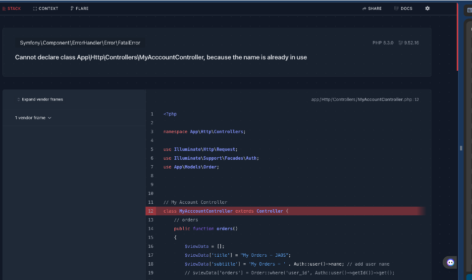

# Cleanup / TODO 

## TODO LIST:

- pre deployment check
- heroku procfile
- database cleanup (update faker factories)
- images 
- Stripe API:
- Issues list
- balance / calculate payments
- Coupons
-  Stripe API Keys
-  
Public:
pk_test_51NYu1ML9zoTSpcm6Fcd59ksXDkyeqil9Aguc2LZrC1aTkgms0547oiV1SAkf8qxguUiersmOGHQjNh9cRQwZAjMA00SXygeYKO

Test:
sk_test_51NYu1ML9zoTSpcm6sVsbV0s9VyYo3bZD9rj1ke8qODPi3UlfU4EALwXF9qG210XBNDt4haPq4fF7UyCxwXaLjd6Z00Hir7X8Y7

- display user balance

ISSUE:
TODO: fix this issue

---

